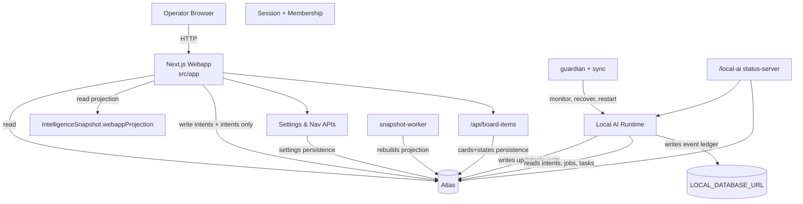
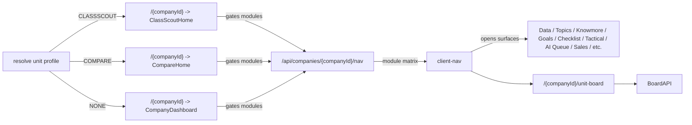

# CHECKLIST Intelligence Unit Control-Plane LLD (v2.0)

This document is the high-precision implementation guide for multi-unit intelligence control, webapp profile routing, and board runtime composition.  
It is intended to be executable by any developer with minimal ambiguity.

It is subordinate to:

1. [docs/RULEBOOK.md](./RULEBOOK.md)
2. [docs/SSOT.md](./SSOT.md)
3. [docs/SYSTEM_DESIGN_LLD.md](./SYSTEM_DESIGN_LLD.md)
4. [docs/IMPLEMENTATION_RULEBOOK.md](./IMPLEMENTATION_RULEBOOK.md)
5. [docs/WEBAPP_READ_MODEL_LLD.md](./WEBAPP_READ_MODEL_LLD.md)

## 1. Why this control-plane exists

The current production system has three realities:

1. Intelligence units are company scopes, but unit behavior is not identical.
2. Local AI performs heavy computation; webapp pages must stay projection-first and lightweight.
3. A board-like execution surface (`unit-board`) must be shared across all surfaces without coupling to specific webapp logic.

This design gives us one strict control plane with these guarantees:

- profile-based routing that supports future webapps
- per-unit capability matrix for module exposure
- one board contract usable by all unit surfaces
- deterministic, observable write/read APIs
- storage policy separation between Atlas operational state and local audit events

The result is predictable production behavior and faster cross-surface onboarding for new units.

## 2. Canonical architecture map



## 3. Runtime topology



### 3.1 Runtime responsibilities

#### Webapp responsibilities
- Resolve webapp profile and modules.
- Render routes from projection contracts.
- Capture operator intents and minimal edits.
- Never run bulk scoring, queue planning, enrichment, or heavy AI orchestration.

#### Local AI responsibilities
- Execute all heavy planning, scoring, scoring repair, pipeline jobs.
- Build webapp projection and operational refresh state.
- Consume operator intents and feed queue/state back to Atlas.
- Persist heavy events in local audit DB, not Atlas.

## 4. Core domain model

### 4.1 Intelligence Unit
- Company-scoped runtime subject.
- Has:
  - storage identity (`company.id`)
  - capability config (`company.workerConfig.unitCapabilities`)
  - projection (`IntelligenceSnapshot`)
  - destination enablement (`destinationInstance`)

### 4.2 Webapp profile
`unitCapabilities.webappProfile` values:
- `NONE`
- `CLASSSCOUT`
- `COMPARE`

### 4.3 Modules
The module key set is:
- `content`
- `data`
- `checklist`
- `analytics`
- `goals`
- `knowmore`
- `pipeline`
- `review`
- `sales`
- `tactical`
- `topics`
- `unit-board`
- `webapp`

`webapp` is always present in every UI profile and maps the dedicated surface route (`/classscout` or `/compare`).

### 4.4 Board domain
- `BoardCard` holds stable card metadata (`title`, `description`, creator, timestamps).
- `BoardItemState` stores board runtime view state (`columnKey`, `orderRank`, `priority`, `metadata`).
- `boardKey` partitions board type:
  - `UNIT_PROJECT` for the shared unit board.
- `entityType` is fixed to `BOARD_CARD` for this surface today.

## 5. Technology stack and dependencies

### 5.1 Webapp stack
- Framework: Next.js 16 App Router
- UI: React 18, Mantine 7, dnd-kit, Tabler icons
- Data: Prisma client, MongoDB Atlas
- Build/test: ESLint, TypeScript, Node scripts

### 5.2 Runtime stack
- Supervisor: `guardian` (watchdog/restart/health)
- Foreground worker: `sync`
- Background worker: `snapshot-worker`
- Local status surface: `status-server`
- AI runtime: Ollama/LLM runtime managed by worker scripts

### 5.3 Storage dependencies
- `DATABASE_URL` points to Atlas
- `LOCAL_DATABASE_URL` points to local Mongo for heavy audit/event tables
- `prisma/schema.prisma` owns Atlas tables; local audit events are written through a dedicated local audit client in `src/lib/local-audit-db.ts`

### 5.4 External package dependencies
- `@dnd-kit/core`, `@dnd-kit/sortable`, `@dnd-kit/utilities` for board drag
- `@mantine/notifications` for operator-visible warnings
- Planned alignment target: UI components from `sovereignsquad/general-design-system` in all new modules

## 6. Data contracts

### 6.1 Persisted worker config contract
Stored in `company.workerConfig` as JSON:

```json
{
  "unitCapabilities": {
    "webappProfile": "CLASSSCOUT",
    "modules": {
      "data": true,
      "checklist": true,
      "unit-board": true
    }
  }
}
```

- `normalizeUnitCapabilitiesPayload` ensures missing keys are backfilled.
- `resolveUnitCapabilities` computes effective profile and module map from:
  - worker config override
  - destination auto-detection (`classscout`, `compare`)
- `formatCapabilityPayload` serializes only normalized keys for storage.

### 6.2 Project board contract
API contract for `unit-board`:

#### Board item shape (API response)
- `id`
- `entityType`
- `boardKey`
- `title`
- `description`
- `createdBy`
- `createdAt`
- `updatedAt`
- `columnKey`
- `orderRank`
- `priority`
- `assignee`
- `dueDate`
- `estimatedEffort`
- `sourceType`
- `sourceId`
- `notes`

#### Column configuration
- `IDEABANK`
- `ROADMAP`
- `BACKLOG`
- `TODO`
- `IN_PROGRESS`
- `REVIEW`
- `DONE`

### 6.3 Projection contract
Used by hot routes:
- `company.counts` and `company.navCounts`
- `readModel.topTasks`
- `readModel.analytics`
- `readModel.projectionFreshness`
- surface-level summary fields from `IntelligenceSnapshot.webappProjection`

### 6.4 Capability contracts
From `src/lib/intelligence-unit-capabilities.ts`:
- `resolveUnitCapabilities(input)` -> `{ profile, modules, source }`
- `normalizeUnitCapabilitiesPayload(raw)` -> validated, merged profile defaults

## 7. Runtime flows and state machines

### 7.1 Route resolution flow
```ts
if (initialData.webappProfile === "CLASSSCOUT") render ClassScoutHome;
else if (initialData.webappProfile === "COMPARE") render CompareHome;
else render CompanyDashboard;
```

Source for `initialData`:
- `getDashboardInitialData(companyId)` resolves:
  - company
  - snapshot
  - destination presence
  - webapp profile and module matrix

### 7.2 Module gated navigation flow
- `ClientNav` fetches `/api/companies/{companyId}/nav`.
- `webapp.profile` and `webapp.modules` come back from nav API.
- `webapp` profile route rendered if available.
- Module list filtered to `moduleCapabilities[key] !== false`.
- Deep-link not required to exist in nav to navigate currently; route should still recover gracefully.

### 7.3 Settings flow
- `GET /api/companies/{companyId}/settings` returns `unitCapabilities`.
- `PATCH /api/companies/{companyId}/settings` writes normalized capabilities if provided.
- Settings UI persists immediately per toggle and route.
- Event emission:
  - `UNIT_SURFACE_UPDATE` interaction event
  - optional follow-up outcome events by operation

### 7.4 Board CRUD flow

#### Create
1. Validate `companyId` and trimmed title.
2. Compute target column (default `TODO` index in current code maps to `TODO`).
3. Transaction:
   - create `BoardCard`
   - create matching `BoardItemState` with incremented rank.
4. Return item + `traceId`.

#### Move
1. Client sends `sourceColumn`, `destinationColumn`, `beforeId`, `afterId`.
2. Ensure balances on destination column if needed.
3. Compute rank from neighbor rows via `computeServerBoardRank`.
4. `upsert` `BoardItemState`.

#### Update
1. Title/description update via `PATCH`.
2. Merge provided metadata and priority if present.
3. Persist metadata state if record exists; otherwise initialize defaults in state.

#### Archive
1. Soft-delete by setting `BoardCard.archivedAt`.

## 8. API contracts (request/response)

### 8.1 `/api/companies/[companyId]/settings`
- `GET` response:
  - `id`, `name`, `allowedLanguages`, `unitCapabilities`.
- `PATCH` request:
  - `allowedLanguages?: string[]`
  - `unitCapabilities?: { webappProfile, modules }`
- `PATCH` response:
  - updated company record + normalized `unitCapabilities`.
- Auth:
  - membership required, admin role for modifications.

### 8.2 `/api/companies/[companyId]/nav`
- `GET` response:
  - `company`
  - `counts` + `features`
  - `webapp.profile`, `webapp.modules`, `webapp.profileLabel`
  - `normalizedCapabilities`
- Auth:
  - membership required.

### 8.3 `/api/board-items`
- `GET` query: `companyId`, optional `boardKey`, optional `traceId`
  - supports only `UNIT_PROJECT` today.
- `POST` body: `companyId`, `boardKey`, `title`, optional metadata
- `PATCH` body:
  - move: `id`, `destinationColumn`, `beforeId`, `afterId`
  - update: `id`, `title`, `description`, metadata
- `DELETE` query: `companyId`, `id`
- Error envelope when persistence failure:
  - `error`, `detail`, `reasonCode`, `retryable`, `retryAfterMs`, `traceId`

## 9. Pseudo-code

### 9.1 Capability resolution
```ts
// Input: workerConfig + destination flags
const capabilities = resolveUnitCapabilities({
  workerConfig: company.workerConfig,
  hasClassScoutDestination: Boolean(classScoutInstance),
  hasCompareDestination: Boolean(compareInstance),
});

// Output:
// { profile: 'CLASSSCOUT'|'COMPARE'|'NONE', modules: Record<module, boolean> }
```

### 9.2 Module filtering
```ts
const navItems = staticItems
  .concat(profileRoute)
  .filter((item) => capabilities.modules[item.key] !== false);
```

### 9.3 Board rank request validation
```ts
function validateBoardRequest(payload) {
  if (!payload.companyId) throw BadRequest;
  if (payload.title && !String(payload.title).trim()) throw BadRequest;
  if (payload.priority !== undefined && !isFiniteNumber(payload.priority)) throw BadRequest;
  if (payload.dueDate && isInvalidDate(payload.dueDate)) throw BadRequest;
}
```

### 9.4 Failure and retry envelope
```ts
if (isQuotaBlocked(error)) {
  return http503({
    error: "MongoDB Atlas storage quota blocked writes",
    reasonCode: "atlas_storage_quota_blocked",
    retryable: true,
    retryAfterMs: 1800000,
    traceId,
  });
}
```

## 10. UI/UX state model and accessibility

### 10.1 Global UI state rules
- Shell and nav always reflect capability state from nav API.
- Module routes hide when disabled by `unitModules` false.
- Counts update on a periodic poll (`WEBAPP_SUMMARY_CLIENT_POLL_MS`).

### 10.2 Unit board UI state model
- loading: full skeleton until first fetch.
- loaded empty state: explicit `drop here` visual.
- success: rendered columns and cards.
- boardError: non-blocking notice with retry options.

### 10.3 Accessibility requirements
- All controls with icon-only behavior need accessible labels.
- Announce errors via notices and notifications.
- Drag/drop path includes Keyboard sensor plus pointer sensor.
- Focus returns after close/open actions; modal actions provide close and submit labels.
- Column headers should be deterministic reading order.

## 11. Observability and instrumentation

### 11.1 Board endpoint telemetry
- request/response per verb
- status by verb and boardKey
- latency buckets
- persistence failure by reason code
- load refresh frequency after write errors

### 11.2 Capability telemetry
- profile resolution source (`auto` vs `custom`)
- unknown profile/mismatch count
- nav payload build time

### 11.3 Local AI collaboration telemetry
- projection freshness age per company
- projection staleness on nav/dashboard read
- destination active run counts
- queue starvation and retry pressure from local worker sources

### 11.4 Logging
- classify and emit `Retry-After` on quota failures in board API.
- add `X-Board-Trace-Id` in every board response.

## 12. Retries, timeouts, and failure policy

### 12.1 Board write policy
- For quota/blocking errors:
  - return structured retry metadata
  - show user action message with retry horizon
  - do not fall back to hidden writes.

### 12.2 Client retry policy
- Create/update/move use optimistic updates.
- On failure: rollback optimistic row and refetch.
- On success: reload once to re-sync server row shape.

### 12.3 Profile/API failure policy
- nav/settings fallback to `NONE` profile if resolution fails.
- board API failures should be visible and not silently ignored.

### 12.4 Timeout strategy
- Use route-level defaults and avoid blocking operations on render.
- board polling use non-store/no-store fetch.

## 13. Rollback and recovery

- `unitCapabilities` toggles are reversible by settings updates.
- Board operations are transactional on create/update state pair.
- Archive operation is reversible only through manual admin-level backfill or DB repair tooling.
- If rank consistency drifts, backend rebalance path recomputes ranks before move writes.

### 13.1 Disaster recovery notes
- If Atlas becomes write-blocked:
  - board and feature writes must preserve behavior without silent data loss
  - keep read-only mode surfaced in UI and rely on local worker to continue own operations where possible
- If nav/profile API fails:
  - keep shell operational
  - route fallback to `NONE` and safe surfaces.

## 14. Testing strategy

### 14.1 Unit tests
- `resolveUnitCapabilities` permutations for destination-only, override-only, combined and invalid payloads.
- rank and ordering helpers (`sortBoardRecords`, `moveBoardItem`, `computeRankBetween`, `computeServerBoardRank`).

### 14.2 API tests
- `/api/board-items`:
  - 400 validation
  - unauthorized access
- move/rebalance correctness
- archive soft-delete behavior
- quota failure response envelope mapping.

### 14.3 Integration tests
- `getDashboardInitialData` profile fallback and module assignment.
- webapp profile switch (NONE->CLASSSCOUT->COMPARE).
- nav module gating and deep-link handling.

### 14.4 E2E tests
- create card visible after successful write.
- move card across columns.
- edit, delete, filter, search.
- compare and classscout profile route rendering.
- disabled module not visible in nav.

### 14.5 Regression tests (must-have)
- quota-saturated Atlas write simulation
- local audit DB disabled mode
- stale `BoardItemState` + existing `BoardCard` mismatch
- local runtime projection staleness window with fallback.

## 15. Security and governance

- Admin role required to patch capability config.
- All board routes require membership verification.
- Inputs sanitized with explicit trim and type coercion.
- No direct DB writes from client.

## 16. Block-based surface composition

Business-level block model:

- **CHECKLIST block** -> data, topics, goals, review, knowmore, analytics, tactical, checklist, pipeline, unit-board
- **SALES block** -> data, knowmore, analytics, pipeline, sales, checklist, review
- **CONTENT block** -> data, knowmore, analytics, content, unit-board
- **PROJECT block** -> unit-board only

Current profile presets:
- NONE preset: core modules mostly on, content OFF
- CLASSSCOUT preset: class-specific modules ON/OFF as curated
- COMPARE preset: tailored reduced module set

Future profiles (for another destination webapp) inherit base preset and then apply profile-specific module overrides.

## 17. Cross-surface adapter model for webapps

### 17.1 Destination surface contract
Any future destination webapp must:
- expose a dedicated root route `/{companyId}/<surface>`
- receive `companyId` only (server obtains all other context)
- remain a separate module surface from core checklist routes
- keep navigation optional and capability-aware

### 17.2 Data sources
- read from server-projected contract or destination-specific service endpoints.
- avoid direct writes into Atlas when route is informational.
- write operator actions through existing intents/events.

## 18. Deployment and execution order

### 18.1 Phase A - foundation hardening
1. Freeze profile/module contract and confirm normalization functions are deterministic.
2. Add end-to-end type-safe schema contract for nav/settings payload.
3. Add tracing and failure envelope contract tests.

### 18.2 Phase B - board reliability
1. Keep board API boardKey/column enforcement explicit.
2. Add client-side move retry backoff for transient 503/timeout.
3. Keep optimistic cache reconciliation deterministic.
4. Keep failed optimistic mutations visible with explicit sync-state until manual recovery succeeds.

### 18.3 Phase C - control-plane completion
1. Keep explicit deep-link fallback behavior on module-guarded routes (route-level checks already added in each surface).
2. Add operational telemetry dashboards for profile drift and module mismatch.
3. Add incident runbook for quota and projection-stale states.

### 18.4 Phase D - generalization
1. Generalize board contract to accept additional boardKeys once other blocks require.
2. Add block adapter docs for each future webapp destination.
3. Expand GDS adoption in all newly added surfaces.

## 19. Edge cases
- Destination exists but profile manually overridden to another value:
  - effective profile from `unitCapabilities` takes precedence, destination used only as default.
- Webapp route typed for disabled module:
  - should show controlled fallback and nav-disabled indicator.
- Board move with invalid neighbor IDs:
  - server reflows around null neighbors and writes bounded rank.
- Rapid reorder bursts:
- client optimistic state is reconciled with server load.
- Local storage failures:
  - audit writes degrade without blocking core board operations.

## 20. Operational behavior

### Development
- enable `BOARD_ITEMS_TRACE=1` only when diagnosing.
- frequent `load` on board after mutation is acceptable.

### Production
- keep trace headers low overhead.
- rely on structured retry responses and user-visible notices.
- avoid feature flags that change payload contracts at runtime.

## 21. Current implementation status

Shipped today:
- profile resolution and settings mutation in `src/lib/intelligence-unit-capabilities.ts`
  - versioned capability envelope (`schemaVersion` + `payload.v`) with legacy drift handling.
- nav capability projection in `src/app/api/companies/[companyId]/nav/route.ts`
  - capability contract fields include `capabilitiesVersion` and `capabilitiesSource` for drift visibility.
- root route dispatch in `src/app/[companyId]/page.tsx`
- shared board APIs in `src/app/api/board-items/route.ts`
- shared board component + project board client in `src/components/board/shared-board.tsx`, `src/app/[companyId]/unit-board/unit-project-board-client.tsx`
- class-specific landing summary contract and UI for ClassScout
- local audit separation primitives in `src/lib/local-audit-db.ts`, `src/lib/audit-ledger.ts`

Remaining hardening (not fully implemented today):
- standardized cross-surface board adapters for non-project future boards
- operational dashboards for module drift and deep-link mismatch events

Implemented in this iteration:
- board mutation robustness:
  - bounded client retry on retryable board write/move failures
  - request timeout guard for board API reads/writes
  - non-lossy create/update/move/archive error handling with visible sync-state
- quota persistence classification broadened to reduce false 500 behavior and improve incident detection

## 22. Reference file map

- `/src/lib/intelligence-unit-capabilities.ts`
- `/src/lib/server-company-page-data.ts`
- `/src/app/[companyId]/page.tsx`
- `/src/app/api/companies/[companyId]/settings/route.ts`
- `/src/app/api/companies/[companyId]/nav/route.ts`
- `/src/app/api/board-items/route.ts`
- `/src/app/[companyId]/unit-board/unit-project-board-client.tsx`
- `/src/components/board/shared-board.tsx`
- `/src/components/classscout-home.tsx`
- `/src/components/compare-home.tsx`
- `/src/lib/local-audit-db.ts`
- `/src/lib/audit-ledger.ts`
- `/src/lib/persistence-failures.ts`
